<div align="center">


# SheetStorm

**The open-source DFIR investigation tracker.**<br />
A structured, collaborative replacement for the incident-response spreadsheet:
timelines, hosts, indicators, evidence and decisions in one place, with an audit trail that holds up afterwards.

<p>
  <a href="LICENSE"></a>
  
  
  
  
  <a href="https://github.com/7a336e6e/sheetstorm"></a>
</p>

<p>
  <a href="#features">Features</a> ·
  <a href="#quick-start">Quick start</a> ·
  <a href="#configuration">Configuration</a> ·
  <a href="#operations">Operations</a> ·
  <a href="#documentation">Docs</a> ·
  <a href="CHANGELOG.md">Changelog</a>
</p>

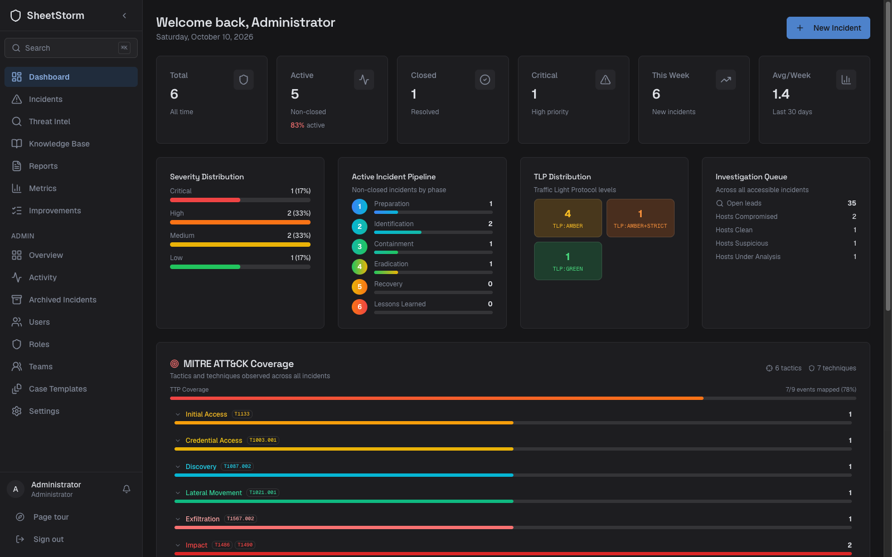

</div>

<br />

## Why SheetStorm?

Many incident response teams still run investigations from a shared spreadsheet, the
SANS-style "spreadsheet of doom". It is quick to start with, until two
people edit the same row, nobody can say who changed a timestamp, evidence hashes live in a
separate document and the final report has to be rebuilt by hand.

SheetStorm keeps that familiar shape (one place per incident for the timeline, hosts,
accounts and indicators) and adds what the spreadsheet cannot: live collaboration without
lost edits, investigative questions that drive the work, a signed chain of custody, a
decision log, an attack graph and a tamper-evident audit trail.

> SheetStorm is an **investigation tracker** for DFIR practitioners, not a SIEM, SOAR or
> alert-triage platform. It is useful for a solo analyst, a training lab, an in-house DFIR
> team or an IR consultancy running several client cases.

## Features

### An incident workspace that replaces the spreadsheet

Every incident has one page with a tab per kind of record: timeline events, hosts, accounts,
network and host indicators, malware and tools, tasks, the playbook, attack graph, MITRE
ATT&CK matrix, evidence, notes, decisions and actions, and the post-incident review.

- **Live collaboration.** Changes from colleagues appear instantly and avatars show who else
  is on the incident. Two people editing the same row get a "changed by someone else" choice
  instead of a silent overwrite.
- **DFIR milestones and metrics.** First malicious activity, detection, response,
  containment, eradication, recovery and closure, with dwell time and time-to-contain.
- **Time zones done right.** Timestamps are stored in UTC and shown in UTC or your browser
  zone with one toggle. Every date-time field has a picker and shows the zone it uses.
- **Hosts with DFIR state.** Triage, acquisition (disk, memory, logs) and containment status
  per host, plus clock-skew correction for hosts whose logs run fast or slow.

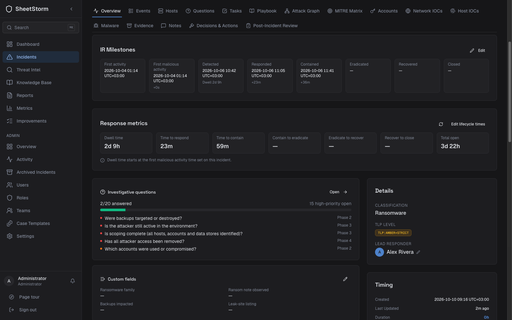

### Investigative questions, leads and case templates

<table>
<tr>
<td width="50%">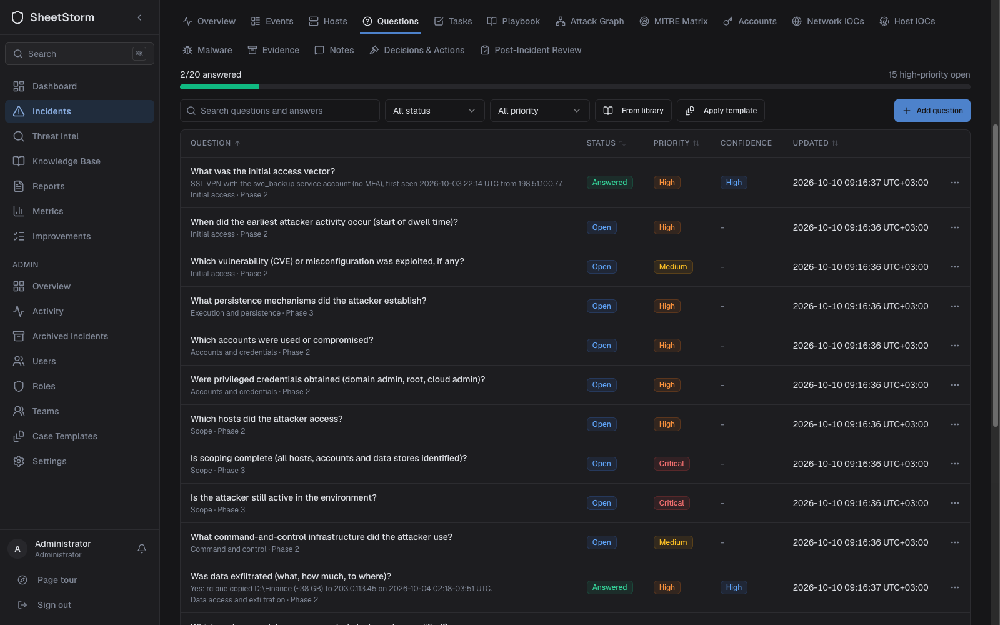</td>
<td width="50%">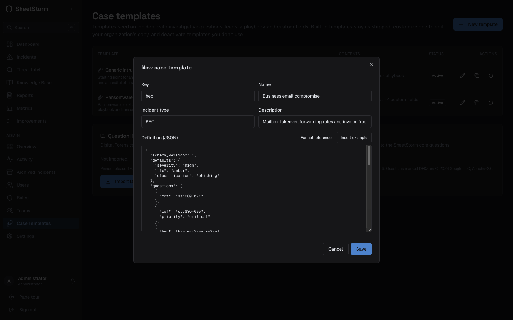</td>
</tr>
</table>

- **Questions drive the investigation.** Track what the case has to answer, record answers
  with a confidence level and the evidence behind them, and link leads (starter tasks) to the
  questions they help answer.
- **Question library.** SheetStorm's core questions, plus a one-click import of Google's
  [DFIQ](https://dfiq.org) catalogue (Apache-2.0), checked against a pinned SHA-256.
- **Case templates.** Seed a new incident with questions, leads, a playbook and custom fields.
  Ransomware and Generic intrusion ship built in. Customize them into your own copy, write
  new ones (the editor has an example and a format reference) or deactivate the ones you
  don't use.

### Attack graph and MITRE ATT&CK

<p align="center">
  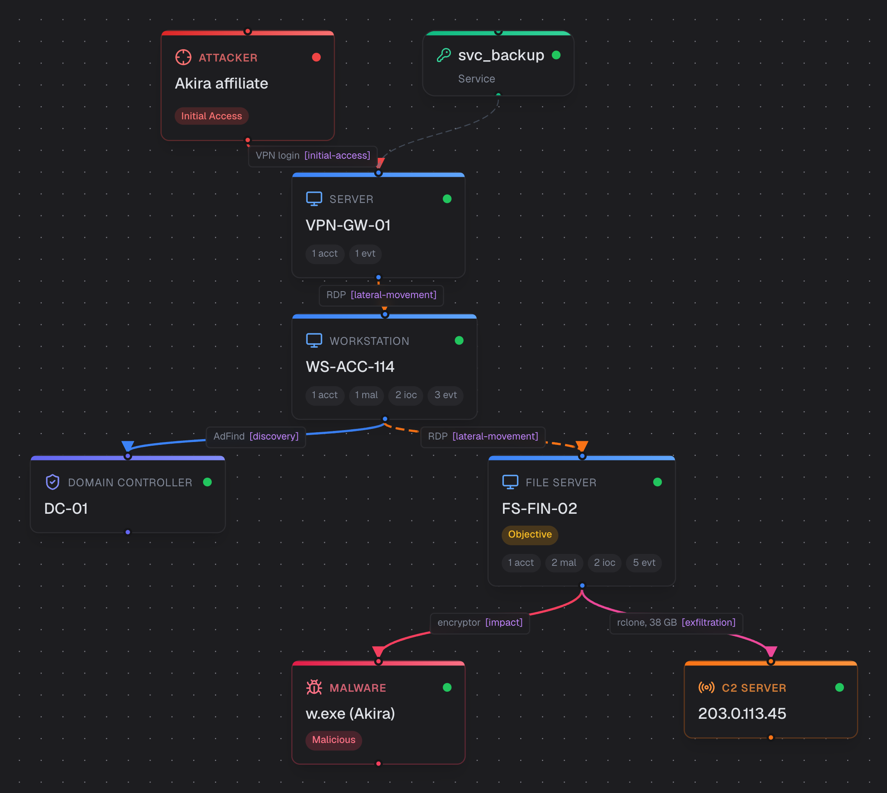
</p>

- **Attack graph** generated from hosts, accounts, indicators, malware and the timeline, then
  edited by hand. Regenerating only adds what is missing and keeps your layout. Export as PNG.
- **ATT&CK mapping** on every timeline event, a matrix with the observed attack chain, and
  technique suggestions from an organization-scoped pattern model.
- **Response overlay.** Show decisions and response actions on the timeline next to attacker
  activity.

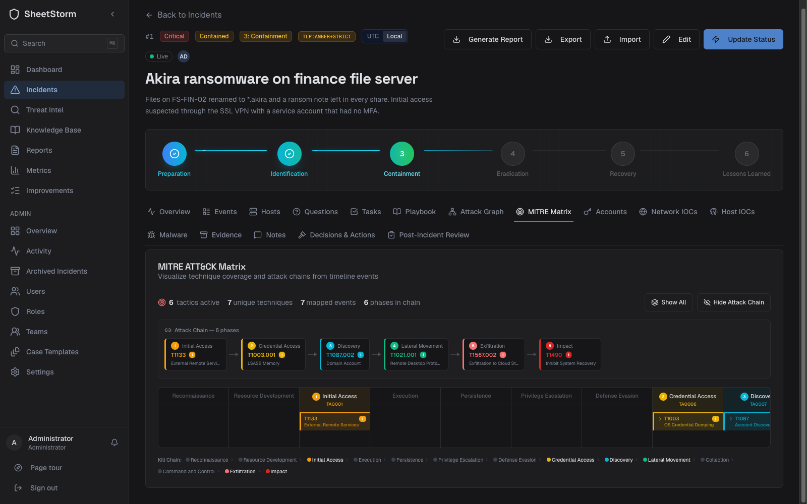

### Evidence and chain of custody

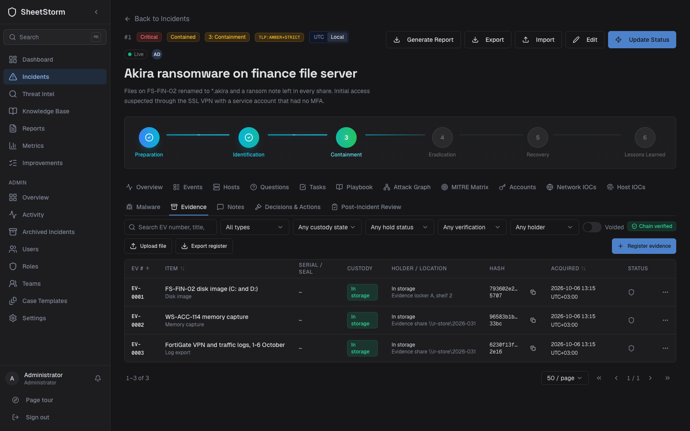

- **Evidence register** (`EV-0001`, ...) for disk images, memory captures, triage packages,
  log exports, devices and files, with acquisition hashes, seals, storage location and
  parent/derived items.
- **Custody ledger.** Check-out, check-in and transfer with acknowledgement, legal hold and
  disposal. The ledger is append-only, hash-chained and HMAC-signed. Optionally anchor it with
  an RFC 3161 timestamp authority.
- **Verifiable exports.** Register CSV/PDF, chain-of-custody forms and custody bundles that
  anyone can verify offline.

### Decisions and response actions

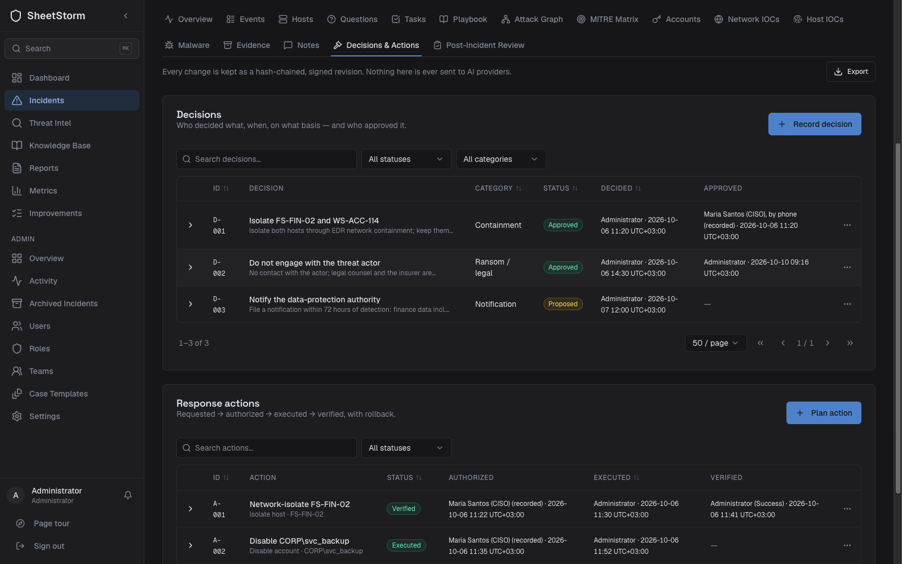

- **Decision log.** Who decided what, when, why, which alternatives were rejected, and who
  approved it (in the app or recorded from a phone call). Privileged decisions are visible
  only to those allowed to read them.
- **Response actions** move from requested to authorized, executed and verified, with rollback
  plans and failures recorded. Every change is a signed, hash-chained revision.

### Administration, access and governance

<table>
<tr>
<td width="50%">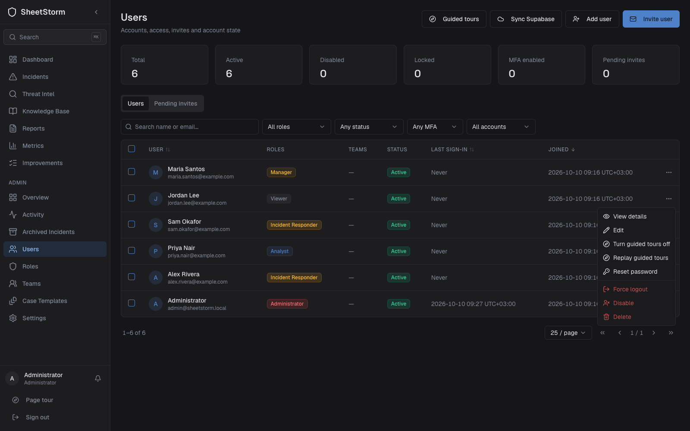</td>
<td width="50%">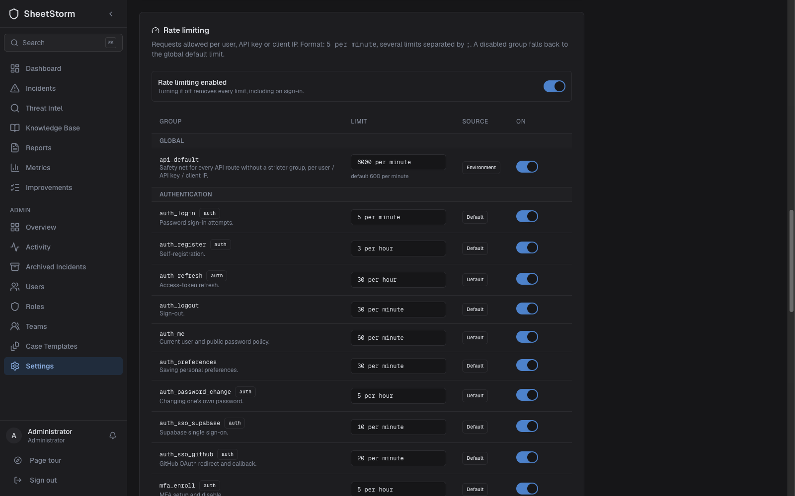</td>
</tr>
<tr>
<td width="50%">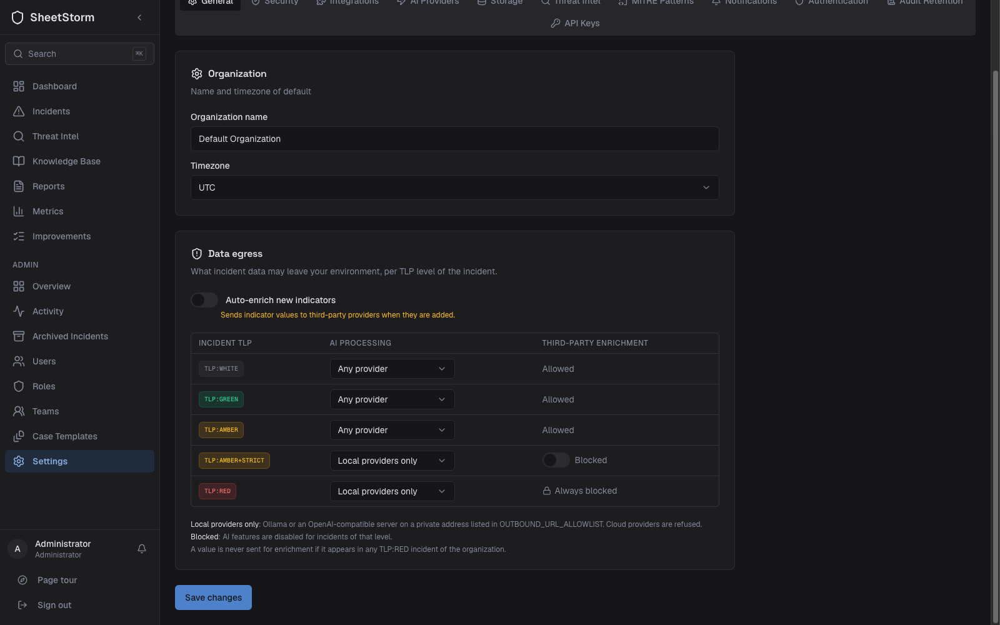</td>
<td width="50%">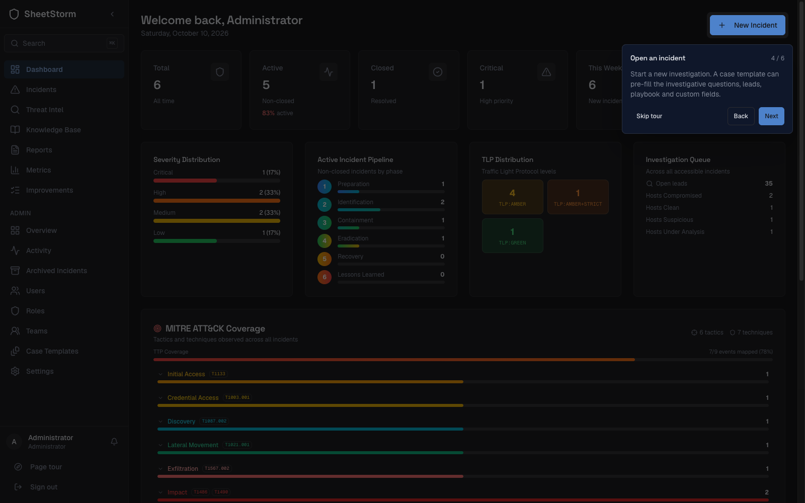</td>
</tr>
</table>

- **Users.** Invitations with one-time links, disable and enable, forced sign-out, unlock,
  password and MFA resets, bulk actions, and guided tours switched on or off per user.
- **Roles and teams.** Six built-in roles with granular permissions, custom roles, teams and
  TLP-based incident visibility. Archived incidents are read-only and invisible without the
  archive permission, even through an old link.
- **Security policy.** Password rules and history, lockout, MFA enforcement, session
  lifetimes and self-registration (closed by default).
- **Rate limits** per route group, editable or switched off from the admin dashboard.
- **Data egress per TLP.** Choose which AI providers may process an incident (any, local only
  or none) and block third-party enrichment for `TLP:AMBER+STRICT`. `TLP:RED` never leaves.
- **API keys and service accounts** with scoped `ssk_…` keys.
- **Audit log** that is append-only and hash-chained per organization, with filters, CSV and
  JSON Lines export, retention and a verification command.
- **Guided tours** on the main pages for new users, replayable from the sidebar.

### Search, reports and threat intelligence

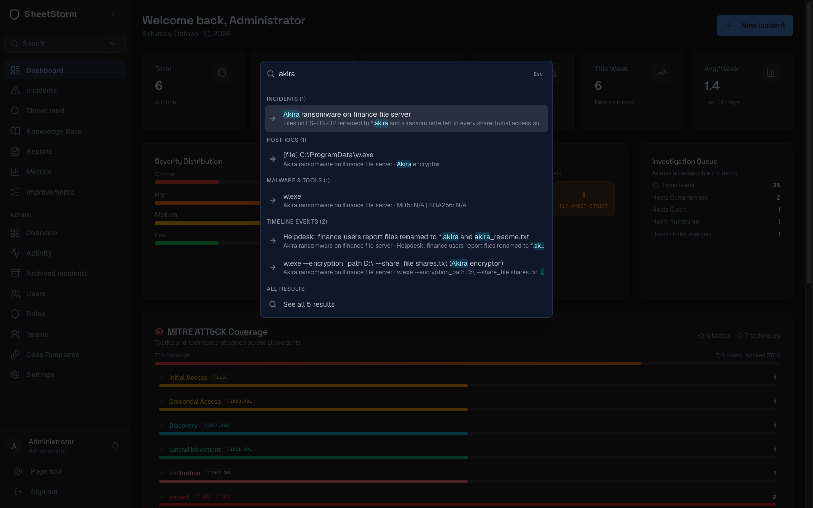

- **Command palette** (`Ctrl/⌘ + K`) across incidents, hosts, indicators, malware, events and
  tasks, plus keyboard shortcuts (`?`).
- **Reports.** AI-written executive and technical reports (OpenAI, Gemini, any
  OpenAI-compatible server or a local Ollama), subject to the TLP egress policy. PDFs are
  immutable snapshots with a SHA-256 checked on every download.
- **Exports.** STIX 2.1 bundles with TLP markings, CSV per record type and MISP push.
- **Threat intel.** CVE lookup with CISA KEV and CVSS, IP, domain and email reputation,
  ransomware leak-site search and IOC defanging. Enrichment is opt-in.
- **Knowledge base.** LOLBAS, security-relevant Windows event IDs and MITRE D3FEND
  countermeasures mapped to ATT&CK.

### MCP server for AI assistants

A [Model Context Protocol](https://modelcontextprotocol.io) server lets Claude, Cursor or
your own agents work a case in natural language, under the same permissions as the user.

- **143 tools** in 22 modules covering incidents, timeline, questions and leads, case
  templates, evidence and custody, decisions, playbooks, IOCs, the attack graph, metrics,
  reports and threat intel.
- **9 prompts** (incident analysis, timeline summary, MITRE mapping, lateral movement,
  executive summary, full report, lessons learned, containment checklist, IOC summary) and
  **7 reference resources**.
- Remote access over SSE with OAuth 2.1 sign-in, or stdio with a scoped API key. For clients
  without remote MCP support (such as Claude Desktop's free plan), `mcp-bridge/` provides a
  local stdio bridge.

### More screenshots

<table>
<tr>
<td width="50%">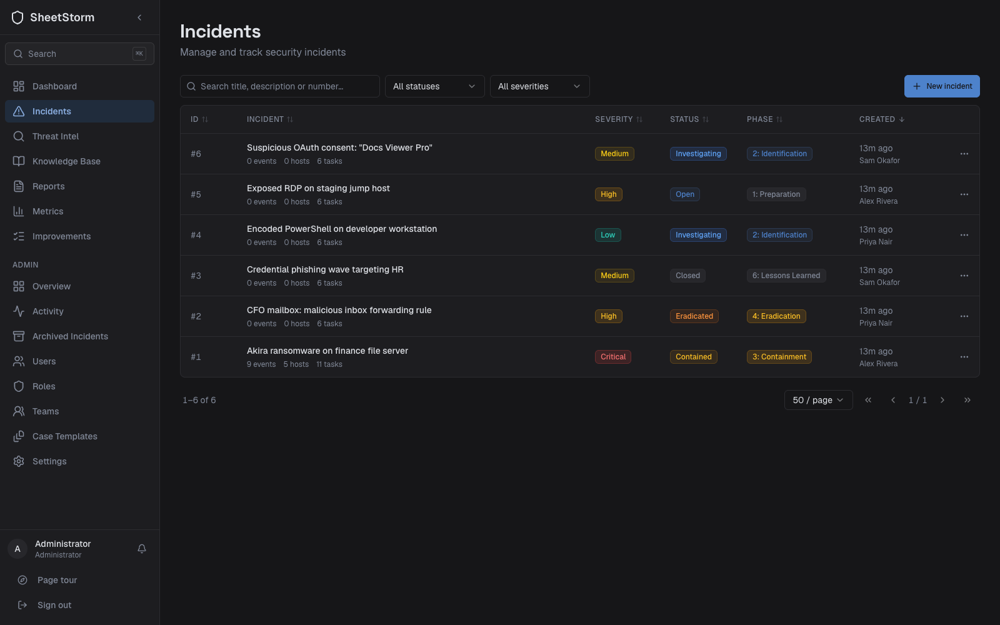</td>
<td width="50%">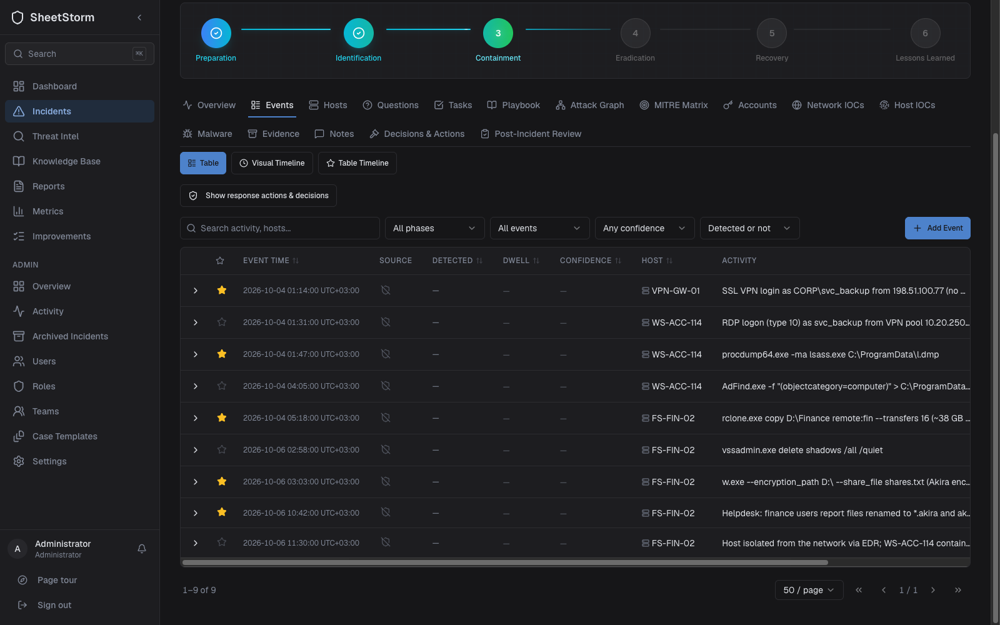</td>
</tr>
</table>

<sub>Screenshots show a fictional case. All names, addresses (RFC 5737) and domains are made up.</sub>

## Quick start

```bash
git clone https://github.com/7a336e6e/sheetstorm.git && cd sheetstorm
./start.sh
```

`start.sh` creates `.env` from `.env.example`, generates the secrets, builds and starts the
containers, applies the database migrations and creates the first administrator.

Open **http://localhost:8080** and sign in as `admin@sheetstorm.local`. With `ADMIN_PASSWORD`
empty in `.env`, a random password is printed **once** in the `start.sh` output. You must
choose a new password at first sign-in. Add further users from **Admin → Users**.

| Service | Address | Notes |
|---|---|---|
| **Web app and API** | `http://localhost:8080` | Always use this one: the nginx proxy serves the UI, `/api` and websockets |
| Frontend | `127.0.0.1:3000` | Debugging only. It has no `/api`, so signing in here fails |
| Backend API | `127.0.0.1:5000/api/v1` | Debugging only |
| MCP server | `127.0.0.1:8811/sse` | Also reachable through the proxy |

**Requirements:** Docker with Compose v2, 2 GB RAM (4 GB recommended).

> Plain HTTP works on `localhost` only. For any other host name, terminate TLS in front of
> the proxy (load balancer, Caddy, a tunnel, ...) and set `FRONTEND_URL` and `CORS_ORIGINS` to
> the `https://` origin. Auth cookies are `Secure`, so signing in over `http://<lan-ip>` fails.

## Configuration

All settings live in `.env` (never commit it). The essentials:

| Variable | Purpose |
|---|---|
| `SECRET_KEY`, `JWT_SECRET_KEY`, `FERNET_KEY` | Generated by `start.sh`. Required in production. Back up `FERNET_KEY`: it encrypts stored integration credentials |
| `CUSTODY_SIGNING_KEY` | Signs the chain of custody. Set once (`openssl rand -hex 32`) and do not rotate casually |
| `AUDIT_CHAIN_KEY` | Keys the tamper-evident audit chain (falls back to `SECRET_KEY` with a warning) |
| `API_KEY_PEPPER` | Pepper for API-key hashes. Changing it invalidates every API key |
| `FRONTEND_URL`, `CORS_ORIGINS` | Your public `https://` origin when not on localhost |
| `TRUSTED_PROXY_CIDRS`, `REAL_IP_HEADER` | Only when another proxy or CDN sits in front. Default: trust no forwarded headers |
| `OUTBOUND_URL_ALLOWLIST` | Internal hosts that integrations may call (Ollama, MISP, a TSA, ...) |
| `TSA_URL` | Optional RFC 3161 timestamp authority for custody anchoring |
| `IOC_AUTO_ENRICH` | `false` by default. Sends new indicators to third-party enrichment |

Rate limits, password and MFA policy, sessions, data egress, integrations, AI providers and
storage are configured in the app under **Admin → Settings**. The full reference, including
deployment presets for common reverse proxies and CDNs, is in
[Configuration](assets/docs/configuration.md).

## Operations

- **Upgrades.** Back up first, then `git pull && docker compose up -d --build`. The backend
  applies migrations on start and refuses to serve a schema it could not migrate.
- **Backups.** The `postgres_data` and `artifacts_data` volumes plus `.env` (especially
  `FERNET_KEY` and `CUSTODY_SIGNING_KEY`).
- **Maintenance commands** (run with `docker compose exec backend flask sheetstorm <command>`):

  | Command | Purpose |
  |---|---|
  | `repair-orphans` | Report (or `--apply` a fix for) rows whose references point at deleted records, which can block an upgrade |
  | `verify-audit-chain` | Check the audit log hash chain of an organization |
  | `purge-audit-logs` | Apply the audit retention policy |
  | `send-due-reminders` | Notify owners of tasks and improvement actions that are due |
  | `run-jobs`, `list-jobs` | Run or list the scheduled background jobs |

- **Tests.** Backend: `./backend/tests/run_in_docker.sh`. Frontend: `npm test`,
  `npx tsc --noEmit` and `npm run lint` in `frontend/`. Everything: `scripts/verify-wp.sh --all`.

## Security

Secure by default: closed self-registration, a generated one-time admin password,
generic login errors with lockout, sessions revoked on password change, CSRF-protected
cookies, a proxy that ignores forwarded client headers unless told otherwise, an allowlist
for outbound requests, and encrypted integration credentials.

The dependency pipeline is hardened against supply-chain attacks: `npm ci` without install
scripts, a 7-day release-age cooldown, exact pins, hash-locked Python requirements and
digest-pinned base images. See [Supply-chain security](assets/docs/supply-chain.md).
Please report vulnerabilities privately as described in [SECURITY.md](SECURITY.md).

## Documentation

| Document | Contents |
|---|---|
| [Architecture](assets/docs/architecture.md) | Services, data flow and design decisions |
| [API reference](assets/docs/api-reference.md) | REST endpoints |
| [WebSocket events](assets/docs/websocket-events.md) | Real-time events and rooms |
| [Configuration](assets/docs/configuration.md) | Every environment variable and deployment presets |
| [Development](assets/docs/development.md) | Local setup, testing and contributing |
| [MCP server](assets/docs/mcp-server-roadmap.md) | MCP tools and integration |
| [Supply-chain security](assets/docs/supply-chain.md) | Dependency policy and compromise playbook |
| [Roadmap](assets/docs/roadmap.md) | What is planned |
| [Changelog](CHANGELOG.md) | Changes and upgrade notes |

## Tech stack

| Layer | Technology |
|---|---|
| Frontend | Next.js 16, React 19, TypeScript 5.9, Tailwind CSS, Radix UI (shadcn/ui), Zustand, React Flow 12 |
| Backend | Python 3.12, Flask 3.1, SQLAlchemy 2.0, Alembic, Flask-SocketIO, Flask-JWT-Extended, Flask-Limiter |
| Data | PostgreSQL 16, Redis 7 |
| Edge | nginx 1.31 reverse proxy |
| AI | OpenAI, Google Gemini, OpenAI-compatible servers, Ollama (all optional) |
| Integrations | VirusTotal, MISP, Google Drive, S3-compatible storage, Slack |

## Contributing

Contributions are welcome. Please open an issue to discuss larger changes first, then fork,
branch, and open a pull request. Dependency changes must follow the
[supply-chain policy](assets/docs/supply-chain.md).

## License

[MIT](LICENSE). Free for personal, educational and commercial use.
